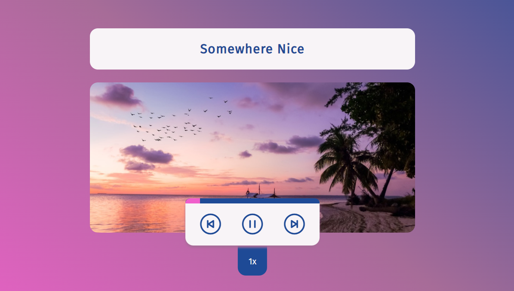

# Simple Music Player 🎵🎼       

      


This is a simple music player app that runs in the browser. All the musics is currently available from the local direcctory, there is not obtained from any external servers or APIs.     

Thanks to the [Chris/Coding in Public](https://github.com/coding-in-public) to guide this tutorial, which is I followed along the [Audio Music Player Playlist](https://www.youtube.com/playlist?list=PLoqZcxvpWzzcxbClFwRIMjj_mYuAqNKku) from his YouTube channel.     


This Simple Music Player App was built on top of Svelte + Vite.     


To test this website locally, you need to have [Node.js](https://nodejs.org/en/) installed on your local machine. Then, kindly download the zip file of the source code. After extract the folder, open the terminal and type         

```Shell
	npm install
	// This will install all the dependencies of the project
```


To run the Simple Music Player App in development mode, type    

```Shell
	npm run dev
```

To build the original source code into JavaScript bundle, type     

```Shell
	npm run build
```

To run the Simple Music Player App in distribution/preview mode, type      

```Shell
	npm run preview
```
